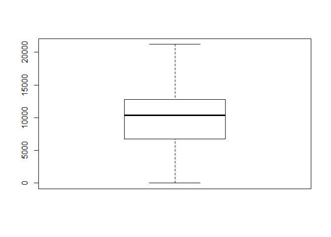
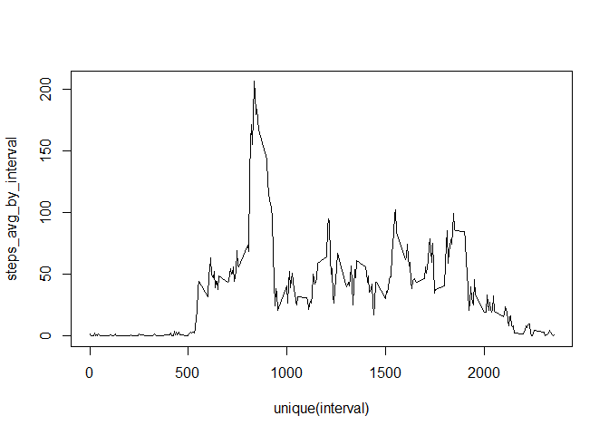
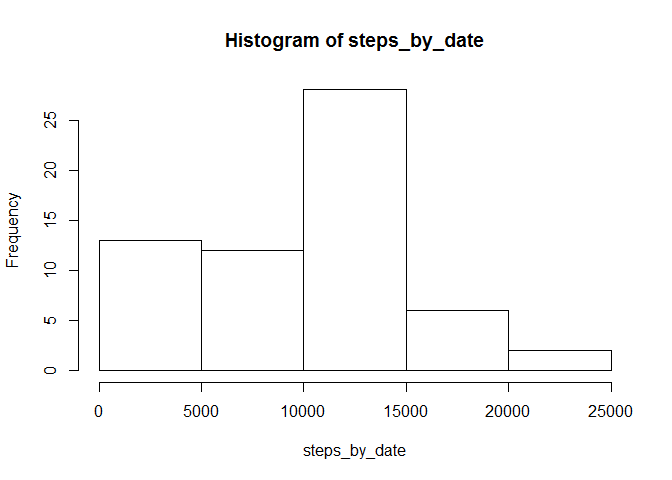
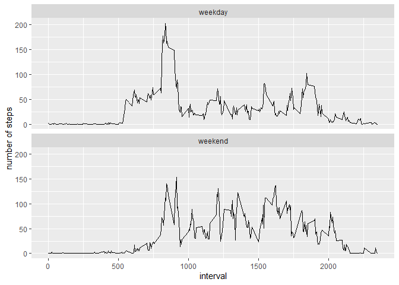

setting


import library

```r
library(sqldf)
```

```
## Loading required package: gsubfn
```

```
## Loading required package: proto
```

```
## Loading required package: RSQLite
```

```r
library(dplyr)
```

```
## 
## Attaching package: 'dplyr'
```

```
## The following objects are masked from 'package:stats':
## 
##     filter, lag
```

```
## The following objects are masked from 'package:base':
## 
##     intersect, setdiff, setequal, union
```

```r
library(ggplot2)
```

## Loading and preprocessing the data


```r
# read data
act <- read.csv('activity.csv')
#change format
act$date <- as.Date(act$date)
```


## What is mean total number of steps taken per day?


```r
steps <- act$steps
date <- act$date
steps_by_date <- tapply(steps, date, sum, na.rm = TRUE)

steps_by_date
```

```
## 2012-10-01 2012-10-02 2012-10-03 2012-10-04 2012-10-05 2012-10-06 2012-10-07 
##          0        126      11352      12116      13294      15420      11015 
## 2012-10-08 2012-10-09 2012-10-10 2012-10-11 2012-10-12 2012-10-13 2012-10-14 
##          0      12811       9900      10304      17382      12426      15098 
## 2012-10-15 2012-10-16 2012-10-17 2012-10-18 2012-10-19 2012-10-20 2012-10-21 
##      10139      15084      13452      10056      11829      10395       8821 
## 2012-10-22 2012-10-23 2012-10-24 2012-10-25 2012-10-26 2012-10-27 2012-10-28 
##      13460       8918       8355       2492       6778      10119      11458 
## 2012-10-29 2012-10-30 2012-10-31 2012-11-01 2012-11-02 2012-11-03 2012-11-04 
##       5018       9819      15414          0      10600      10571          0 
## 2012-11-05 2012-11-06 2012-11-07 2012-11-08 2012-11-09 2012-11-10 2012-11-11 
##      10439       8334      12883       3219          0          0      12608 
## 2012-11-12 2012-11-13 2012-11-14 2012-11-15 2012-11-16 2012-11-17 2012-11-18 
##      10765       7336          0         41       5441      14339      15110 
## 2012-11-19 2012-11-20 2012-11-21 2012-11-22 2012-11-23 2012-11-24 2012-11-25 
##       8841       4472      12787      20427      21194      14478      11834 
## 2012-11-26 2012-11-27 2012-11-28 2012-11-29 2012-11-30 
##      11162      13646      10183       7047          0
```

```r
boxplot(steps_by_date)
```

<!-- -->

```r
hist(steps_by_date)
```

<!-- -->

```r
mean(steps_by_date)
```

```
## [1] 9354.23
```

```r
median(steps_by_date)
```

```
## [1] 10395
```

the mean steps of these dates is 9354.23
the mean steps of these dates is 10395


## What is the average daily activity pattern?


```r
interval <- act$interval
steps_avg_by_interval <- tapply(steps, interval, mean, na.rm = TRUE)

plot(unique(interval), steps_avg_by_interval, type = 'l', )
```

<!-- -->

```r
max_interval_no <- match(max(steps_avg_by_interval), steps_avg_by_interval)
#the same as the match func: which(steps_avg_by_interval == max(steps_avg_by_interval))
steps_avg_by_interval[max_interval_no]
```

```
##      835 
## 206.1698
```

the 835 interval contains the maximum number of steps


## Imputing missing values

calculate missing rows

```r
miss_row <- act[is.na(act$steps) | is.na(act$date) | is.na(act$interval), ]
nrow(miss_row)
```

```
## [1] 2304
```
there are 2304 rows with NA value


the strategy to fullfill the missing value: use the avg steps of that date or 0

```r
na_replace <- tapply(steps, date, mean, na.rm = TRUE)
na_replace[is.na(na_replace)]=0

na_replace <- data.frame(date = unique(act$date),
                         avg_steps = na_replace
                         )

act <-  sqldf('select
                        case when steps is null then n.avg_steps
                        else steps end 
                        as steps
                        ,a.date
                        ,a.interval
                from 
                        act a
                        left join na_replace n on a.date = n.date
              ')
```


Make a histogram of the total number of steps taken each day and Calculate and report the mean and median total number of steps taken per day

```r
steps <- act$steps
date <- act$date
steps_by_date <- tapply(steps, date, sum, na.rm = TRUE)

steps_by_date
```

```
## 2012-10-01 2012-10-02 2012-10-03 2012-10-04 2012-10-05 2012-10-06 2012-10-07 
##          0        126      11352      12116      13294      15420      11015 
## 2012-10-08 2012-10-09 2012-10-10 2012-10-11 2012-10-12 2012-10-13 2012-10-14 
##          0      12811       9900      10304      17382      12426      15098 
## 2012-10-15 2012-10-16 2012-10-17 2012-10-18 2012-10-19 2012-10-20 2012-10-21 
##      10139      15084      13452      10056      11829      10395       8821 
## 2012-10-22 2012-10-23 2012-10-24 2012-10-25 2012-10-26 2012-10-27 2012-10-28 
##      13460       8918       8355       2492       6778      10119      11458 
## 2012-10-29 2012-10-30 2012-10-31 2012-11-01 2012-11-02 2012-11-03 2012-11-04 
##       5018       9819      15414          0      10600      10571          0 
## 2012-11-05 2012-11-06 2012-11-07 2012-11-08 2012-11-09 2012-11-10 2012-11-11 
##      10439       8334      12883       3219          0          0      12608 
## 2012-11-12 2012-11-13 2012-11-14 2012-11-15 2012-11-16 2012-11-17 2012-11-18 
##      10765       7336          0         41       5441      14339      15110 
## 2012-11-19 2012-11-20 2012-11-21 2012-11-22 2012-11-23 2012-11-24 2012-11-25 
##       8841       4472      12787      20427      21194      14478      11834 
## 2012-11-26 2012-11-27 2012-11-28 2012-11-29 2012-11-30 
##      11162      13646      10183       7047          0
```

```r
hist(steps_by_date)
```

<!-- -->

```r
mean(steps_by_date)
```

```
## [1] 9354.23
```

```r
median(steps_by_date)
```

```
## [1] 10395
```
Mean and median total number of steps taken per day does not differ from the estimates from the first part of the assignment. There is no impact of imputing missing data on the estimates of the total daily number of steps.


## Are there differences in activity patterns between weekdays and weekends?


```r
week_sort <- if_else(weekdays(act$date) %in% c('星期六','星期日'),'weekend','weekday')
week_sort <- as.factor(week_sort)
act$week_sort <- week_sort

act_week_perform <- 
        act %>%
        group_by(week_sort, interval) %>%
        summarise(mean_step = mean(steps))

g <- ggplot(act_week_perform, aes(x=interval, y=mean_step))
g + geom_line() +
    facet_wrap( ~ week_sort, nrow = 2, ncol = 1) +
    labs(y = 'number of steps')
```

<!-- -->

on weekend the activity is more active


